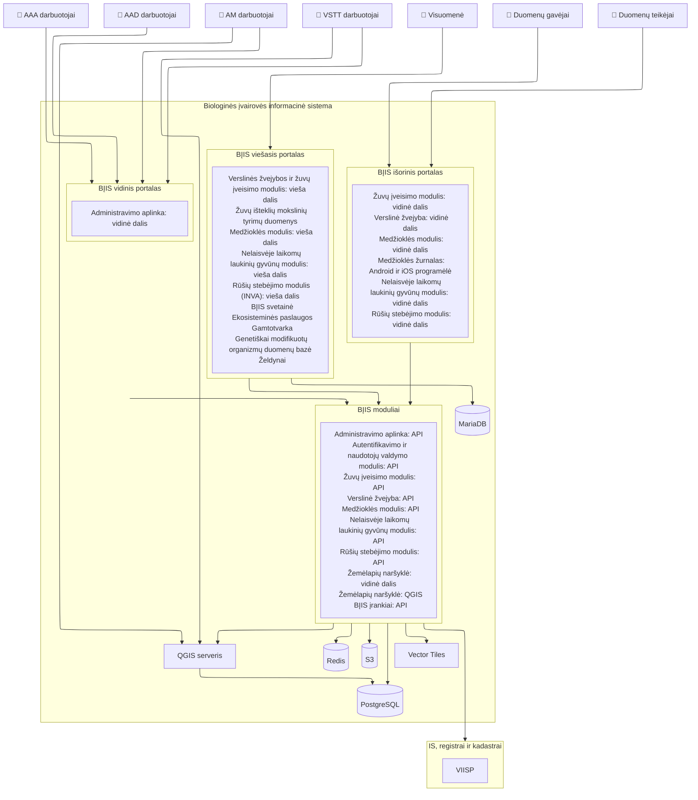

```mermaid
flowchart-elk

aaa["👤 AAA darbuotojai"]
aad["👤 AAD darbuotojai"]
am["👤 AM darbuotojai"]
vstt["👤 VSTT darbuotojai"]
visuomene["👤 Visuomenė"]
tiekejas["👤 Duomenų gavėjai"]
gavejas["👤 Duomenų teikėjai"]

subgraph "Biologinės įvairovės informacinė sistema"
subgraph admin["BĮIS vidinis portalas"]
  biip_admin_web["Administravimo aplinka: vidinė dalis"]
end

subgraph web["BĮIS išorinis portalas"]
  all_web["Žuvų įveisimo modulis: vidinė dalis
  Verslinė žvejyba: vidinė dalis
  Medžioklės modulis: vidinė dalis
  Medžioklės žurnalas: Android ir iOS programėlė
  Nelaisvėje laikomų laukinių gyvūnų modulis: vidinė dalis
  Rūšių stebėjimo modulis: vidinė dalis"]
end

subgraph public["BĮIS viešasis portalas"]
  all_public["Verslinės žvejybos ir žuvų įveisimo modulis: vieša dalis
  Žuvų išteklių mokslinių tyrimų duomenys
  Medžioklės modulis: vieša dalis
  Nelaisvėje laikomų laukinių gyvūnų modulis: vieša dalis
  Rūšių stebėjimo modulis (INVA): vieša dalis
  BĮIS svetainė
  Ekosisteminės paslaugos
  Gamtotvarka
  Genetiškai modifikuotų organizmų duomenų bazė
  Želdynai"]
end

subgraph api["BĮIS moduliai"]
  all_api["Administravimo aplinka: API
  Autentifikavimo ir naudotojų valdymo modulis: API
  Žuvų įveisimo modulis: API
  Verslinė žvejyba: API
  Medžioklės modulis: API
  Nelaisvėje laikomų laukinių gyvūnų modulis: API
  Rūšių stebėjimo modulis: API
  Žemėlapių naršyklė: vidinė dalis
  Žemėlapių naršyklė: QGIS
  BĮIS įrankiai: API"]
end

postgresql[("PostgreSQL")]
mariadb[("MariaDB")]
redis[("Redis")]
s3[("S3")]
qgis["QGIS serveris"]
vt["Vector Tiles"]
end

subgraph remote["IS, registrai ir kadastrai"]
    viisp["VIISP"]
%%    alis["ALIS"]
%%    adresu_registras["Adresų registras"]
%%    st_kadastras["Saugomų teritorijų kadastras"]
%%    misku_kadastras["Miškų valstybės kadastras"]
%%    geoportalas["Geoportalas"]
%%    nekilnojamo_kadastras["Nekilnojamo turto kadastras"]
end

am --> qgis
am --> admin

vstt --> qgis
vstt --> admin

visuomene --> public

aad --> admin
aaa --> admin

tiekejas --> web
gavejas --> web

api --> postgresql
public --> mariadb
api --> redis
api --> s3
api --> qgis
api --> vt
api --> remote

qgis --> postgresql

web --> api
public --> api
admin --> api
```
