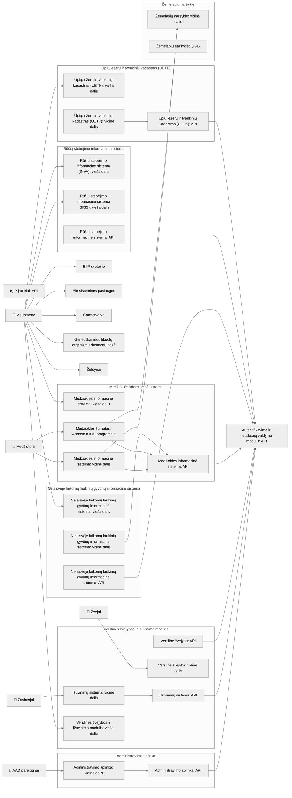

```mermaid
%%{init: {'theme':'neutral'}}%%


%% ======== API =======
%% biip_admin_api
%% biip_auth_api
%% biip_zuvinimas_api
%% biip_zvejyba_api
%% biip_medziokle_api
%% biip_gyvunai_api
%% biip_rusys_api
%% biip_uetk_api


%% ======== PUBLIC =======
%% biip_zuvys_public
%% biip_medziokle_public
%% biip_gyvunai_public
%% biip_inva_public
%% biip_sris_public
%% biip_uetk_public
%% biip_public
%% biip_ekosistemos_public
%% biip_gamtotvarka_public
%% biip_gmo_public
%% biip_zeldynai_public


%% ======== WEB =======
%% biip_admin_web
%% biip_zuvinimas_web
%% biip_zvejyba_web
%% biip_medziokle_web
%% biip_gyvunai_web
%% biip_uetk_web
%% biip_maps_web


%% ======== MOBILE =======
%% biip_medziokle_mobile


%% ======== OTHER =======
%% viisp_auth_helper
%% biip_qgis_server


%% ======== DATABASE =======
%% mariadb
%% postgresql
%% redis
%% s3


%% ======== ACTORS =======
%% visuomene
%% aad
%% medziotojai
%% zuvintojai
%% zvejai


graph LR
  subgraph "Administravimo aplinka"
    biip_admin_web["Administravimo aplinka: vidinė dalis"]
    biip_admin_api["Administravimo aplinka: API"]
  end


%%  subgraph "Autentifikavimo ir naudotojų valdymo modulis"
    biip_auth_api["Autentifikavimo ir naudotojų valdymo modulis: API"]
%%    viisp_auth_helper["VIISP helper????"]
%%  end

  subgraph "Verslinės žvejybos ir įžuvinimo modulis"
    biip_zuvinimas_web["Įžuvinimų sistema: vidinė dalis"]
    biip_zuvinimas_api["Įžuvinimų sistema: API"]
    biip_zvejyba_web["Verslinė žvejyba: vidinė dalis"]
    biip_zvejyba_api["Verslinė žvejyba: API"]
    biip_zuvys_public["Verslinės žvejybos ir įžuvinimo modulis: vieša dalis"]
  end

  subgraph "Medžioklės informacinė sistema"
    biip_medziokle_public["Medžioklės informacinė sistema: vieša dalis"]
    biip_medziokle_web["Medžioklės informacinė sistema: vidinė dalis"]
    biip_medziokle_mobile["Medžioklės žurnalas: Android ir iOS programėlė"]
    biip_medziokle_api["Medžioklės informacinė sistema: API"]
  end

  subgraph "Nelaisvėje laikomų laukinių gyvūnų informacinė sistema"
    biip_gyvunai_public["Nelaisvėje laikomų laukinių gyvūnų informacinė sistema: vieša dalis"]
    biip_gyvunai_web["Nelaisvėje laikomų laukinių gyvūnų informacinė sistema: vidinė dalis"]
    biip_gyvunai_api["Nelaisvėje laikomų laukinių gyvūnų informacinė sistema: API"]
  end

  subgraph "Rūšių stebėjimo informacinė sistema"
    biip_inva_public["Rūšių stebėjimo informacinė sistema (INVA): vieša dalis"]
    biip_sris_public["Rūšių stebėjimo informacinė sistema (SRIS): vieša dalis"]
    biip_rusys_api["Rūšių stebėjimo informacinė sistema: API"]
  end

  subgraph "Upių, ežerų ir tvenkinių kadastras (UETK)"
    biip_uetk_public["Upių, ežerų ir tvenkinių kadastras (UETK): vieša dalis"]
    biip_uetk_web["Upių, ežerų ir tvenkinių kadastras (UETK): vidinė dalis"]
    biip_uetk_api["Upių, ežerų ir tvenkinių kadastras (UETK): API"]
  end

  subgraph "Žemėlapių naršyklė"
    biip_maps_web["Žemėlapių naršyklė: vidinė dalis"]
    biip_qgis_server["Žemėlapių naršyklė: QGIS"]
  end

  biip_tools["BĮIP įrankiai: API"]

%% Other public
  biip_public["BĮIP svetainė"]
  biip_ekosistemos_public["Ekosisteminės paslaugos"]
  biip_gamtotvarka_public["Gamtotvarka"]
  biip_gmo_public["Genetiškai modifikuotų organizmų duomenų bazė"]
  biip_zeldynai_public["Želdynai"]


%%  postgresql[("PostgreSQL")]
%%  mariadb[("MariaDB")]
%%  redis[("Redis")]
%%  s3[("S3")]

  visuomene["👤 Visuomenė"]
  aad["👤 AAD pareigūnai"]
  medziotojai["👤 Medžiotojai"]
  zuvintojai["👤 Žuvintojai"]
  zvejai["👤 Žvejai"]


%% Links
  visuomene --> biip_zuvys_public
  visuomene --> biip_medziokle_public
  visuomene --> biip_gyvunai_public
  visuomene --> biip_inva_public
  visuomene --> biip_sris_public
  visuomene --> biip_uetk_public
  visuomene --> biip_public
  visuomene --> biip_ekosistemos_public
  visuomene --> biip_gamtotvarka_public
  visuomene --> biip_gmo_public
  visuomene --> biip_zeldynai_public

  aad --> biip_admin_web

  medziotojai --> biip_medziokle_web
  medziotojai --> biip_medziokle_mobile

  zuvintojai --> biip_zuvinimas_web

  zvejai --> biip_zvejyba_web

  biip_medziokle_web --> biip_maps_web
  biip_medziokle_mobile --> biip_maps_web

  biip_admin_api --> biip_auth_api
  biip_zuvinimas_api --> biip_auth_api
  biip_zvejyba_api --> biip_auth_api
  biip_medziokle_api --> biip_auth_api
  biip_gyvunai_api --> biip_auth_api
  biip_rusys_api --> biip_auth_api
  biip_uetk_api --> biip_auth_api

%%  biip_auth_api --> viisp_auth_helper
  biip_admin_web --> biip_admin_api
  biip_zuvinimas_web --> biip_zuvinimas_api
  biip_medziokle_web --> biip_medziokle_api
  biip_medziokle_mobile --> biip_medziokle_api
  biip_gyvunai_web --> biip_medziokle_api
  %% rusys?? --> api?
  biip_uetk_web --> biip_uetk_api


%% Database relations
%%  biip_admin_api --> postgresql
%%  biip_auth_api --> postgresql
%%  biip_zuvinimas_api --> postgresql
%%  biip_zvejyba_api --> postgresql
%%  biip_medziokle_api --> postgresql
%%  biip_gyvunai_api --> postgresql
%%  biip_rusys_api --> postgresql
%%  biip_uetk_api --> postgresql

%%  biip_admin_api --> s3
%%  biip_auth_api --> s3
%%  biip_zuvinimas_api --> s3
%%  biip_zvejyba_api --> s3
%%  biip_medziokle_api --> s3
%%  biip_gyvunai_api --> s3
%%  biip_rusys_api --> s3
%%  biip_uetk_api --> s3

%%  biip_admin_api --> redis
%%  biip_auth_api --> redis
%%  biip_zuvinimas_api --> redis
%%  biip_zvejyba_api --> redis
%%  biip_medziokle_api --> redis
%%  biip_gyvunai_api --> redis
%%  biip_rusys_api --> redis
%%  biip_uetk_api --> redis

%%  biip_zuvys_public --> mariadb
%%  biip_medziokle_public --> mariadb
%%  biip_gyvunai_public --> mariadb
%%  biip_inva_public --> mariadb
%%  biip_sris_public --> mariadb
%%  biip_uetk_public --> mariadb
%%  biip_public --> mariadb
%%  biip_ekosistemos_public --> mariadb
%%  biip_gamtotvarka_public --> mariadb
%%  biip_gmo_public --> mariadb
%%  biip_zeldynai_public --> mariadb


```
