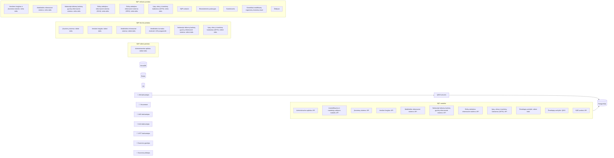

```mermaid
graph LR
      subgraph admin["BĮIP vidinis portalas"]
        biip_admin_web["Administravimo aplinka: vidinė dalis"]
      end

      subgraph web["BĮIP išorinis portalas"]
        biip_zuvinimas_web["Įžuvinimų sistema: vidinė dalis"]
        biip_zvejyba_web["Verslinė žvejyba: vidinė dalis"]

        biip_medziokle_web["Medžioklės informacinė sistema: vidinė dalis"]
        biip_medziokle_mobile["Medžioklės žurnalas: Android ir iOS programėlė"]

        biip_gyvunai_web["Nelaisvėje laikomų laukinių gyvūnų informacinė sistema: vidinė dalis"]
        biip_uetk_web["Upių, ežerų ir tvenkinių kadastras (UETK): vidinė dalis"]
      end

      subgraph public["BĮIP viešasis portalas"]
        biip_zuvys_public["Verslinės žvejybos ir įžuvinimo modulis: vieša dalis"]
        biip_medziokle_public["Medžioklės informacinė sistema: vieša dalis"]
        biip_gyvunai_public["Nelaisvėje laikomų laukinių gyvūnų informacinė sistema: vieša dalis"]
        biip_inva_public["Rūšių stebėjimo informacinė sistema (INVA): vieša dalis"]
        biip_sris_public["Rūšių stebėjimo informacinė sistema (SRIS): vieša dalis"]
        biip_uetk_public["Upių, ežerų ir tvenkinių kadastras (UETK): vieša dalis"]
        biip_public["BĮIP svetainė"]
        biip_ekosistemos_public["Ekosisteminės paslaugos"]
        biip_gamtotvarka_public["Gamtotvarka"]
        biip_gmo_public["Genetiškai modifikuotų organizmų duomenų bazė"]
        biip_zeldynai_public["Želdynai"]
      end

      subgraph api["BĮIP moduliai"]
        biip_admin_api["Administravimo aplinka: API"]
        biip_auth_api["Autentifikavimo ir naudotojų valdymo modulis: API"]
        biip_zuvinimas_api["Įžuvinimų sistema: API"]
        biip_zvejyba_api["Verslinė žvejyba: API"]
        biip_medziokle_api["Medžioklės informacinė sistema: API"]
        biip_gyvunai_api["Nelaisvėje laikomų laukinių gyvūnų informacinė sistema: API"]
        biip_rusys_api["Rūšių stebėjimo informacinė sistema: API"]
        biip_uetk_api["Upių, ežerų ir tvenkinių kadastras (UETK): API"]

        biip_maps_web["Žemėlapių naršyklė: vidinė dalis"]
        biip_qgis_server["Žemėlapių naršyklė: QGIS"]

        biip_tools["BĮIP įrankiai: API"]
      end

      postgresql[("PostgreSQL")]
      mariadb[("MariaDB")]
      redis[("Redis")]
      s3[("S3")]
      qgis["QGIS serveris"]

      api --> postgresql

    am["👤 AM darbuotojas"]


  visuomene["👤 Visuomenė"]
  aad["👤 AAD darbuotojas"]
  aaa["👤 AAA darbuotojas"]
  vstt["👤 VSTT darbuotojas"]
  tiekejas["👤 Duomenų gavėjas"]
  gavejas["👤 Duomenų tiekėjas"]


am --> qgis
qgis --> postgresql


```
