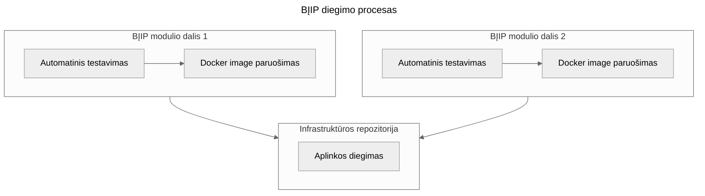

# Techninė informacija

## Techninis stakas

### Infrastruktūra

1. GitHub: naudojamas kodo saugojimui, artefaktų valdymui, projektų valdymui (_GitHub Projects_) ir automatizacijų
   vykdymui (_GitHub Actions_);
2. Docker ir Docker compose: naudojami konteinerių paleidimui ir valdymui virtualiose mašinose;
3. Git-crypt ir GitHub Actions Secrets: paslapčių (angl. _secrets_) valdymui;
4. Postgres su Postgis: kaip pagrindinė duomenų bazė;
5. MariaDB: duomenų bazė, naudojama WordPress;
6. Redis: spartinančioji atmintinė (angl. _cache_) ir eilių valdymas;
7. S3: failų saugykla (naudojant VITC teikiamą paslaugą;
8. Caddy: atvirkštinis tarpinis serveris (angl. _reverse proxy_);
9. Better Stack Uptime: prieinamumo stebėsena;
10. Sentry: klaidų ir greitaveikos stebėsena;
11. Grafana, Prometheus, Loki, AlertManager: stebėsena ir žurnalo įrašų kaupimas;
12. Zabbix: virtualių mašinų stebėsena;
13. PostMark: elektroninių laiškų siuntimas;
14. Google Analytics: svetainių lankomumo stebėsena;
15. QGIS: geoerdvinių duomenų apdorojimas, peržiūra ir analizė;
16. Martin: geoerdvinių vektorinių duomenų generavimas;

### API (angl. _Application Programming Interface_)

Node.js su [Moleculer](https://moleculer.services/) sistema.

### Kliento dalis

1. React ir Vue: interaktyvioms naudotojų sąsajoms;
2. WordPress: turinio valdymo sistema;
3. Medžioklės žurnalas mobilioji programėlė naudoja React-Native ir Fastlane diegimų automatizacijoms;

## Virtualios mašinos

Naudojamos VITC teikiamos ir valdomos virtualios mašinos.

1. **APP-BĮIP**: veikia bandomosios aplinkos (atitinkamai Development ir Staging), kurias sudaro
   tiek BĮIP moduliai, tiek tų aplinkų duomenų bazės;
2. **PROD-BĮIP**: šioje virtualioje mašinoje veikia gamybinė aplinka su visais BĮIP moduliais;
3. **BU-BĮIP**: virtualioje mašinoje veikia duomenų bazės naudojamos gamybinėje aplinkoje (pvz., Postgres su PostGIS ir
   MariaDB);
4. **INFRA-BĮIP**: veikia įvairūs BĮIP infrastruktūriniai įrankiai, tokie
   kaip [Sentry](https://sentry.io/), [GitHub self-hosted](https://docs.github.com/en/actions/hosting-your-own-runners/managing-self-hosted-runners/about-self-hosted-runners)
   agentas;
5. **BACKUP-BĮIP**: ši virtuali mašina naudojama atsarginėms kopijoms, pvz., duomenų bazių;

## Diegimo procesas

Visi BĮIP atliekami diegimai yra automatizuoti naudojant GitHub actions. Detalesnį BĮIP diegimo procesą iliustruoja ši
schema:

### Diegimo žingsniai

1. **Automatinis testavimas:**
    * BĮIP projekto dalis automatiškai testuojama naudojant GitHub Actions (pvz., automatiniai testai, statinė kodo
      analizė su CodeQL, viešai žinomus pažeidžiamumų analizė);
2. **Docker image paruošimas:**
    * Naudojant : [Reusable Workflows](https://github.com/AplinkosMinisterija/reusable-workflows)
      paruošiamas Docker image;
    * Docker image patalpinamas ghcr.io registre.
3. **Aplinkos diegimas:**
    * Centrinėje BĮIP infrastruktūros konfigūracijos repizitorijoje per docker compose atitinkamoje virtualioje mašinoje
      paleidžiama
      atnaujinta diegiama BĮIP projekto dalis;
    * Centrinė BĮIP infrastruktūros konfigūracijos repozitorija sukurta remiantis GitOps praktika;
